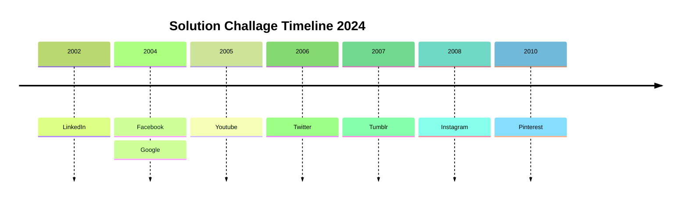

# Welcome to SkillBoost 

At **GDSC GSU**, we firmly believe in the transformative potential of skill development. Our mentorship program, SkillBoost, is meticulously crafted to empower our members with not just expertise but the essential skills necessary to harness the full potential of Google Technology. 

:::warning
We are dedicated to nurturing a community of tech enthusiasts equipped to build viable solutions that address local challenges.
:::

## what is GDSC 

**Google Developer Student Clubs** are university based community groups for students interested in Google developer technologies. 
:::note[note]

Students from all undergraduate or graduate programs with an interest in growing as a developer are welcome. 
:::

By joining a **GDSC**, students grow their knowledge in a peer-to-peer learning environment and build solutions for local businesses and their community.

### Why SkillBoost?

  
**Skill First Approach**

  

     

     We prioritize skill development as the cornerstone of innovation.
     

  

- **Practical Expertise:** Gain hands-on experience to confidently leverage Google Technology.
- **Local Solutions:** Our focus is on cultivating skills that directly contribute to solving local problems.
- **Innovation Mindset:** Immerse yourself in a culture that values creativity, critical thinking, and solution-oriented approaches.

### What Sets SkillBoost Apart?

- **Holistic Learning:** Beyond expertise, we emphasize the essential skillset needed for real-world application.
- **Google Technology Focus:** Tailored to take full advantage of Google's cutting-edge tools and platforms.
- **Community Support:** Engage with a vibrant community, collaborating on projects and sharing insights.
- **Impact-Driven:** Transform your skills into tangible solutions that make a difference.

## The SkillBoost Journey

1. **Skill Development:** Embark on a journey where skill development takes center stage. Master the tools and techniques that form the foundation of impactful tech solutions.

2. **Google Technology Integration:** Learn how to harness the power of Google Technology. From Cloud solutions to APIs, unlock the capabilities that can elevate your projects.

3. **Local Problem Solving:** Apply your skills to address local challenges. Develop solutions that matter, making a positive impact on your community.

## Join SkillBoost Today!

Ready to be part of a community that believes in Skill First? Join SkillBoost now and kickstart your journey towards becoming a tech innovator.

<!-- [Apply Now Button] -->

## Have Questions?

Explore our FAQ section or get in touch for more information.

<!-- [FAQ Button] -->

## Follow Us for Updates

Stay connected on social media for program updates, success stories, and more.

<!-- [Social Media Icons] -->
