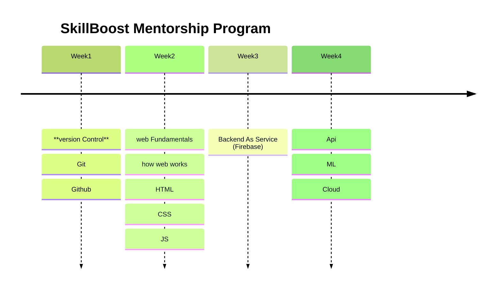

# Welcome to SkillBoost 

At **GDSC GSU**, we firmly believe in the transformative potential of skill development. Our mentorship program, SkillBoost, is meticulously crafted to empower our members with not just expertise but the essential skills necessary to harness the full potential of Google Technology. 

We are dedicated to nurturing a community of tech enthusiasts equipped to build viable solutions that address local challenges.

## what is GDSC 

**Google Developer Student Clubs** are university based community groups for students interested in Google developer technologies. 

:::note[note]

Students from all undergraduate or graduate programs with an interest in growing as a developer are welcome. 
:::

By joining a **GDSC**, students grow their knowledge in a peer-to-peer learning environment and build solutions for local businesses and their community.

# GDSC SkillBoost Mentorship Program

The **SkillBoost Mentorship Program** at Gombe State University is an innovative initiative aimed at enhancing skills and fostering innovation among students. 

Open to all students across various faculties and levels of study, the program offers a comprehensive learning experience with a focus on practical applications. 

It covers a range of topics, including version control, web fundamentals, Firebase integration, TensorFlow applications, and more. 

The program is structured over two months, featuring weekly sessions that progressively build participants' skills

# SkillBoost Mentorship Program timeline 

Stay tuned for more details on how to enroll and be a part of this transformative experience. Get ready to unleash your full potential!

**Connect**. **Learn**. **Grow**.

## Why SkillBoost?

  
 Skill First Approach

  

     

     We prioritize skill development as the cornerstone of innovation.
     

  

  
 Practical Expertise 

  

     

     Gain hands-on experience to confidently leverage Google Technology
     

  

  
 Local Solutions

  

     

      Our focus is on cultivating skills that directly contribute to solving local problems.
     

  

  
Innovation Mindset

  

     

     Immerse yourself in a culture that values creativity, critical thinking, and solution-oriented approaches.
     

  

## What Sets SkillBoost Apart?

- **Holistic Learning:** Beyond expertise, we emphasize the essential skillset needed for real-world application.

- **Community Support:** Engage with a vibrant community, collaborating on projects and sharing insights.
- **Impact-Driven:** Transform your skills into tangible solutions that make a difference.

- **Skill Development:** Embark on a journey where skill development takes center stage. Master the tools and techniques that form the foundation of impactful tech solutions.

- **Google Technology Integration:** Learn how to harness the power of Google Technology. From Cloud solutions to APIs, unlock the capabilities that can elevate your projects.

- **Local Problem Solving:** Apply your skills to address local challenges. Develop solutions that matter, making a positive impact on your community.

## Have Questions?

Explore our FAQ section or get in touch for more information.

 Who can participate in the program ?

 

open to students from all faculties and academic levels at Gombe State University, aiming for inclusivity and diverse participation.
 

What topics and skills are covered in the program ? 

 

 Covers version control, web fundamentals, Firebase integration, TensorFlow applications, and more. Emphasizes technical expertise and essential skills for real-world applications.
 

Are there any prerequisites for joining the program ? 

 

 While no strict prerequisites, a basic understanding of programming concepts may be beneficial. The program accommodates learners at various skill levels.
 

Is there any cost associated with the SkillBoost Mentorship Program ? 

 

 Aims to be accessible to all students. Details about costs or potential scholarships will be communicated during the application process.
 

How can I stay updated on program announcements and activities ?

   

      

      Regular updates, announcements, and relevant information will be shared through official university channels, including emails, notices, and social media platforms
      

   

## [Join SkillBoost Today!](./intro.md)

Ready to be part of a community that believes in Skill First? Join SkillBoost now and kickstart your journey towards becoming a tech innovator.

## Follow Us for Updates

Stay connected on social media for program updates, success stories, and more.

<!-- [Social Media Icons] -->
